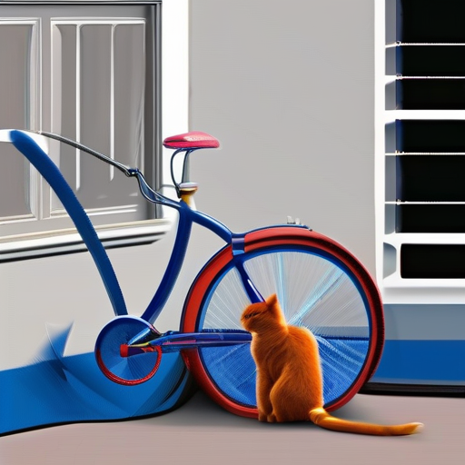
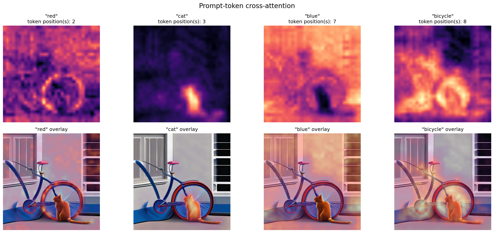

# SDXL Attention Explorer

A lightweight Python package for capturing and visualizing
prompt-token cross-attention maps in Stable Diffusion XL.

The project intercepts cross-attention inside the SDXL U-Net, connects
attention columns to readable prompt tokens, aggregates maps across layers and
spatial resolutions, and produces heatmaps over the generated image.

## Example output

Given the prompt:

```text
a red cat sitting beside a blue bicycle
```

### Generated image

<p align="center">
  
</p>

### Prompt-token cross-attention

<p align="center">
  
</p>

The example above shows cross-attention heatmaps and overlays for the tokens
`red`, `cat`, `blue`, and `bicycle`.

## Features

* Stable Diffusion XL image generation
* Prompt-token inspection using both SDXL tokenizers
* Automatic lookup of token positions from readable text
* Cross-attention capture from U-Net `attn2` layers
* Separation of down, middle, and up U-Net blocks
* Support for multiple spatial attention resolutions
* Classifier-free guidance branch selection
* Multi-token and subword aggregation
* Heatmap, overlay, and comparison-grid visualization
* Automatic restoration of the original Diffusers attention processors
* Unit tests for storage, tokenization, aggregation, recording, and visualization

## Example

Given the prompt:

```text
a red cat sitting beside a blue bicycle
```

the package can produce attention maps for tokens such as:

```text
red
cat
blue
bicycle
```

The output directory contains the generated image, individual token visualizations, a comparison grid, tokenization information, and generation metadata.

```text
outputs/example/
├── generated_image.png
├── attention_red.png
├── attention_cat.png
├── attention_blue.png
├── attention_bicycle.png
├── attention_grid.png
├── prompt_tokens.txt
└── metadata.json
```

## Installation

Clone the repository and install it in editable mode:

```bash
git clone https://github.com/KimiaVanaei/sdxl-attention-explorer.git
cd sdxl-attention-explorer
pip install -e .
```

For development tools:

```bash
pip install -e ".[dev]"
```

The project currently targets:

* Python 3.10 or newer
* PyTorch 2.1 or newer
* Diffusers 0.38.0
* Transformers 4.44 or newer, below version 5

## Hugging Face authentication

The example script expects a Hugging Face access token. Do not hardcode the token in Python files, notebooks, or Git history.

A read token is sufficient for downloading the model.

### Terminal

Authenticate once with:

```bash
hf auth login
```

The script will detect the stored token through `huggingface_hub`.

### Google Colab

Add the token to Colab Secrets using the name:

```text
HF_TOKEN
```

Then expose it to the notebook environment:

```python
import os
from google.colab import userdata

token = userdata.get("HF_TOKEN")

if not token:
    raise RuntimeError("HF_TOKEN was not found in Colab Secrets.")

os.environ["HF_TOKEN"] = token
```

## Command-line example

Run the complete example from the repository root:

```bash
python examples/visualize_sdxl.py \
    --prompt "a red cat sitting beside a blue bicycle" \
    --tokens red cat blue bicycle \
    --height 512 \
    --width 512 \
    --steps 20 \
    --guidance-scale 5.0 \
    --seed 42 \
    --output-dir outputs/example
```

The script performs the full workflow:

1. Verifies Hugging Face authentication.
2. Loads `stabilityai/stable-diffusion-xl-base-1.0`.
3. Prints the prompt-token table.
4. Finds the requested token positions.
5. Installs temporary recording processors.
6. Generates the image and records cross-attention.
7. Restores the original optimized attention processors.
8. Aggregates token maps.
9. Saves visualizations and metadata.

### Main command-line options

```text
--prompt              Prompt used for generation
--tokens              Readable prompt tokens to visualize
--model-id            Hugging Face model repository
--height              Output image height
--width               Output image width
--steps               Number of denoising steps
--guidance-scale      Classifier-free guidance scale
--seed                Random seed
--resolutions         Attention-grid resolutions to retain
--block-groups        U-Net regions to include
--output-dir          Directory for generated files
```

For example, to visualize only up-block attention at resolution 16:

```bash
python examples/visualize_sdxl.py \
    --prompt "a red cat sitting beside a blue bicycle" \
    --tokens cat bicycle \
    --block-groups up \
    --resolutions 16 \
    --output-dir outputs/up_blocks
```

## Python API

### Load SDXL

```python
import torch
from diffusers import StableDiffusionXLPipeline
from huggingface_hub import get_token

model_id = "stabilityai/stable-diffusion-xl-base-1.0"
token = get_token()

if token is None:
    raise RuntimeError("Hugging Face authentication is required.")

pipe = StableDiffusionXLPipeline.from_pretrained(
    model_id,
    torch_dtype=torch.float16,
    variant="fp16",
    use_safetensors=True,
    token=token,
)

pipe.enable_model_cpu_offload()
```

### Inspect prompt tokens

```python
from sdxl_attention import (
    find_token_positions,
    format_prompt_tokens,
    inspect_sdxl_prompt,
)

prompt = "a red cat sitting beside a blue bicycle"

tokenization = inspect_sdxl_prompt(
    pipe,
    prompt,
)

tokens = tokenization["tokenizer_1"]

print(format_prompt_tokens(tokens))

cat_positions = find_token_positions(
    tokens,
    "cat",
)

bicycle_positions = find_token_positions(
    tokens,
    "bicycle",
)
```

### Record cross-attention

```python
from sdxl_attention import (
    AttentionRecorder,
    AttentionStore,
)

store = AttentionStore(
    image_size=(512, 512),
    use_classifier_free_guidance=True,
    allowed_resolutions={16, 32},
    allowed_block_groups={
        "down",
        "mid",
        "up",
    },
    storage_device="cpu",
)

generator = torch.Generator(
    device="cuda"
).manual_seed(42)

with AttentionRecorder(
    pipe.unet,
    store,
):
    result = pipe(
        prompt=prompt,
        height=512,
        width=512,
        num_inference_steps=20,
        guidance_scale=5.0,
        generator=generator,
    )

generated_image = result.images[0]

print(store.summary())
```

The original Diffusers processors are restored automatically when the context exits, including when generation raises an exception.

### Aggregate and visualize

```python
from sdxl_attention import (
    aggregate_token_attention,
    plot_attention_grid,
)

attention_results = {
    "cat": aggregate_token_attention(
        store=store,
        token_positions=cat_positions,
        output_size=(512, 512),
    ),
    "bicycle": aggregate_token_attention(
        store=store,
        token_positions=bicycle_positions,
        output_size=(512, 512),
    ),
}

plot_attention_grid(
    image=generated_image,
    results=attention_results,
    save_path="outputs/attention_grid.png",
)
```

## How it works

### 1. Prompt tokenization

SDXL uses two text encoders. Their token-level embeddings are combined along the embedding dimension, while the cross-attention token axis remains aligned to the tokenizer positions.

The package exposes these positions as readable `PromptToken` objects.

### 2. Cross-attention interception

The U-Net contains self-attention and cross-attention processors:

```text
attn1 → self-attention over latent image features
attn2 → cross-attention between image features and prompt tokens
```

Only `attn2` processors are replaced.

The recording processor explicitly computes:

```text
softmax(scale × QKᵀ)
```

and forwards the resulting attention probabilities to `AttentionStore`.

### 3. Classifier-free guidance

With classifier-free guidance, the effective batch is arranged as:

```text
[unconditional samples, conditional samples]
```

The store retains only the conditional prompt branch.

### 4. Memory-conscious aggregation

Instead of retaining every attention tensor, the store:

* selects one conditional sample;
* averages attention heads immediately;
* groups maps by U-Net region and spatial resolution;
* maintains running sums and counts;
* moves stored aggregates to CPU.

Stored tensors have the form:

```text
[spatial height, spatial width, token positions]
```

### 5. Token-map aggregation

For a selected token position, the package:

1. extracts the corresponding attention channel;
2. combines subword positions when necessary;
3. resizes each component to image resolution;
4. averages selected U-Net groups and resolutions;
5. min-max normalizes the final map for visualization.

Normalization is applied only after aggregation.

## Project structure

```text
sdxl-attention-explorer/
├── examples/
│   └── visualize_sdxl.py
├── src/
│   └── sdxl_attention/
│       ├── __init__.py
│       ├── aggregation.py
│       ├── processor.py
│       ├── recorder.py
│       ├── store.py
│       ├── tokens.py
│       └── visualization.py
├── tests/
│   ├── test_aggregation.py
│   ├── test_processor.py
│   ├── test_recorder.py
│   ├── test_store.py
│   ├── test_tokens.py
│   └── test_visualization.py
├── .gitignore
├── pyproject.toml
└── README.md
```

## Development

Run the tests:

```bash
pytest -q
```

Run the linter:

```bash
ruff check .
```

Apply automatically fixable Ruff changes:

```bash
ruff check . --fix
```

## Interpretation notes

Attention maps can help investigate questions such as:

* Which image region is associated with a noun?
* Does an adjective attend to the intended object?
* How do down, middle, and up U-Net blocks differ?
* How do coarse and fine attention resolutions differ?
* Does a prompt token receive localized or diffuse attention?

However:

* attention is not equivalent to causal attribution.
* attention is not guaranteed to align with object boundaries.
* independently normalized maps should not be compared as absolute scores.
* nouns and adjectives may exhibit different spatial behavior.
* averaging layers and resolutions hides some internal variation.
* generated images may vary slightly across hardware and library versions.

## Current scope

Version `0.1.0` focuses on:

* SDXL base
* one generated image at a time
* positive-prompt cross-attention
* layer and resolution aggregation
* static PNG visualization

## Possible future work

* Denoising-step-aware aggregation
* Per-layer and per-head visualization
* Negative-prompt attention
* Batch generation support
* Additional Diffusers pipelines
* Quantitative localization metrics
* Interactive notebook widgets
* Automatic word-to-subword grouping
* Comparison of attention aggregation strategies
